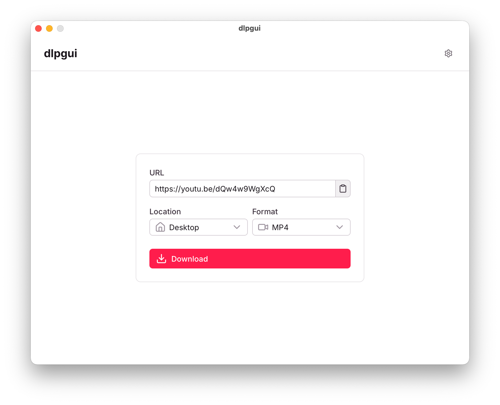

# dlpgui

Minimal GUI for the great [yt-dlp](https://github.com/yt-dlp/yt-dlp) built with [Electrobun](https://github.com/blackboardsh/electrobun), [Nuxt 4](https://nuxt.com/), and [Nuxt UI](https://ui.nuxt.com/).

This was mainly a 2-day exercise to get my hands dirty with [Electrobun](https://github.com/blackboardsh/electrobun), the [Oxc](https://oxc.rs/) toolchain and [Nuxt/Vue i18n](https://i18n.nuxtjs.org/).

Also uses [ytdlp-nodejs](https://npmx.dev/package/ytdlp-nodejs) with some of the binary downloading logic adapted to my needs.

<picture>
  <source media="(prefers-color-scheme: dark)" srcset="./.github/assets/dlpgui-main-dark.png">
  <source media="(prefers-color-scheme: light)" srcset="./.github/assets/dlpgui-main.png">
  
</picture>

## Features

- Dead-Simple UI
- Not AI-slopped together
- Automatic `yt-dlp` and `ffmpeg` installation
- Pick from 3 formats:
  - `MP3`
  - `MP4` (fastest combined audio+video, youtube limits this to around 720p)
  - `MP4 (best quality)` (uses ffmpeg to combine best video and audio)
- Pick custom or from a list of common download locations
- Paste from clipboard button
- Progress reporting
- Button to show downloaded file in folder
- Light and dark modes
- Auto-updates
- German and English translations (both bad)
- Custom yt-dlp channel (stable or nightly)
- Windows and Mac versions (can't be bothered to test on linux)

## Install

Download the latest release from the [releases page](https://github.com/vaaski/dlpgui/releases/latest).

Direct download links:

- [Windows](https://github.com/vaaski/dlpgui/releases/latest/download/stable-win-x64-dlpgui-Setup.zip)
- [Mac (Apple Silicon)](https://github.com/vaaski/dlpgui/releases/latest/download/stable-macos-arm64-dlpgui.dmg)
- [Mac (Intel)](https://github.com/vaaski/dlpgui/releases/latest/download/stable-macos-x64-dlpgui.dmg)

## Thoughts

Electrobun is great. Documentation could use some work, but I really haven't missed any features. I also love that I can pick CEF or the system webview without a single line of Rust. Auto-updates out of the box are fantastic.

I think I'll give Oxc a bit more time, I already invested a lot into my ESLint (+stylistic) config and I don't mind it enough right now to make the switch. Seems inevitable though.

Nuxt/Vue i18n is cool, but I need to put some more time into making it type-safe and stuff.

## Development

Install dependencies:

```bash
bun install
```

Generate Nuxt output (needed for Electrobun first start)

```bash
bun run nuxt:generate
```

Run dev

```bash
bun run dev

# watch the console.
# electrobun might be faster than the 5s wait time allocated for nuxt to start up.
```

## Build

Create the generated Nuxt frontend and bundle the desktop app:

```bash
bun run build
```

## Future

Again, this was just an exercise to touch some new tech. This might not ever be updated, or updated very frequently if I feel like it.

I am open to contributions though.

<br>

<a href="https://brainmade.org">
	<picture>
		<source media="(prefers-color-scheme: dark)" srcset="https://brainmade.org/white-logo.svg">
		<source media="(prefers-color-scheme: light)" srcset="https://brainmade.org/black-logo.svg">
		
	</picture>
</a>

[](https://wakatime.com/badge/user/bc63fe59-dab3-4d67-8b03-cf7cac9cad4f/project/03d24906-9ed8-4c67-8f66-f063bd42800c)
